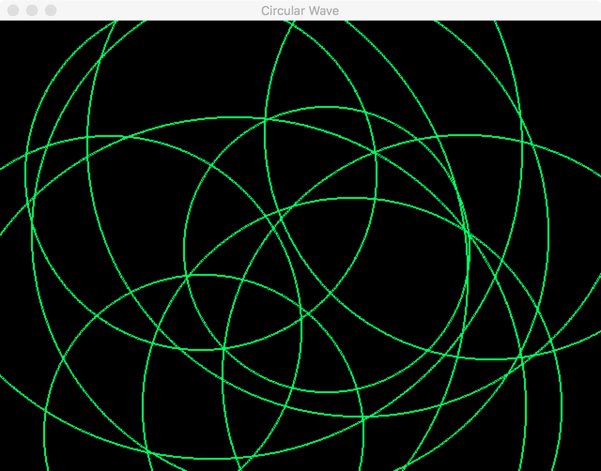

# Pygame을 이용한 2D 원형파 시뮬레이션

## 개발환경
- Python 2.7.12
- Pygame 1.9.2b6
- PyCharm Community Edition 2016.2
- OS X El Capitan 10.11.6

Pycharm은 Cross Platform IDE이기 때문에, 컴퓨터 운영체제는 그리 신경쓰지 않아도 된다.  
OS X의 경우 Homebrew Package Manager을 이용해서 설치하면 매우 간편하다.  
대다수가 사용할 위도우즈 운영체제의 개발환경 준비 과정은 추가바람.

## 스크린샷



## 설명

객체지향적으로 프로그래밍한다. 마우스로 콘솔의 한 지점을 클릭하면, 그 지점을 중심으로 하는 원형파가 만들어진다. 각 원형파는 일정한 속도로 퍼져나간다.

## 소스코드

소스코드는 크게 세 부분으로 나누어서 설명할 수 있다:

### 초기화

```
pygame.init()
screen_width = 640
screen_height = 480
screen = pygame.display.set_mode((screen_width, screen_height))
pygame.display.set_caption("Circular Wave")
```
`pygame.init()` 함수를 사용해서 Pygame을 초기화시킨다.  
`pygame.display.set_mode()` 함수를 사용해서 콘솔창을 생성한다.  
`pygame.display.set_caption()` 함수를 사용해서 콘솔창의 제목을 설정해준다.  

### 클래스 정의

```
class Wave():
    def __init__(self, pos):
        self.pos = pos
        self.radius = 2
        self.speed = 5
        self.color = (0, 255, 100)
        self.width = 2

    def propagate(self):
        self.radius += self.speed

    def draw(self):
        pygame.draw.circle(
            screen,
            self.color,
            self.pos,
            self.radius,
            self.width
        )

    def is_stable(self):
        if self.radius > max(screen_width, screen_height):
            return True
        else:
            return False
```

`Wave`라는 클래스를 정의하고 있다. C++의 클래스나 Java를 배웠다면 어렵지 않게 이해할 수 있을 것이다. 파이썬 객체지향 프로그래밍에 대한 강의는 추가바람.

### 구동부

```
while not done:
    for event in pygame.event.get():
        if event.type == pygame.QUIT:
            done = True

        if event.type == pygame.MOUSEBUTTONUP:
            pos = pygame.mouse.get_pos()
            waves.append(Wave(pos))

    screen.fill((0, 0, 0))
    for i in waves:
        if i.is_stable():
            waves.remove(i)
        else:
            i.propagate()
            i.draw()

    pygame.display.flip()
```

프로그램 전체를 `while`문 안에서 구동하고 있다. Pygame을 비롯한 여러 GUI 라이브러리는 Double Buffering을 지원해서 콘솔창에서 일어나는 일들이 자연스럽게 보여질 수 있도록 도와준다. Double Buffer는 Front Buffer와 Back Buffer로 이루어져 있는데, Front Buffer는 현재 콘솔창에서 보여지는 부분이고, Back Buffer는 다음에 보여질 화면을 그리는 부분이다.

`screen.fill()` 함수는 `(0, 0, 0)`(RGB로 따졌을 때 검은색에 해당하는) 값을 넣어줘서 Back Buffer을 모두 검은색으로 칠하고 있고, 마지막에 `pygame.display.flip()` 함수를 사용해서 Front Buffer와 Back Buffer을 사로 바꿔주고, Back Buffer에 그렸던 것이 콘솔창에 보이게 한다.

## 한 걸음 더 나아가기

1. 가속도의 개념을 도입해서 물결파가 점점 빨리 퍼져나가도록 만들어보자
2. 마우스 클릭을 하지 않아도 일정 시간마다 임의의 점에서 원형파가 만들어지도록 해보자.